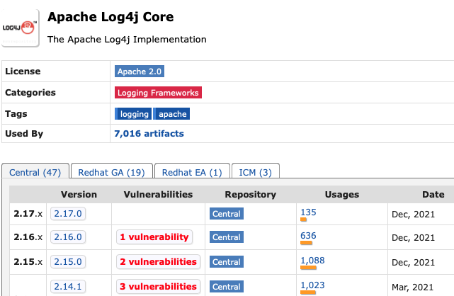

# Log4Shell vulnerabilities in Log4J2

CVE-2021-44228
CVE-2021-45046
CVE-2021-45105

### Slides and demo code:

https://github.com/mschmnet/Log4Shell-demo

---

Logo by Lunasec, CC BY-SA 4.0, https://commons.wikimedia.org/w/index.php?curid=113465600

---

# Contents

1. Introduction 
2. CVE-2021-44228
3. CVE-2021-45046
4. CVE-2021-45105
5. Learnings

---

1. **Introduction**
2. CVE-2021-44228
3. CVE-2021-45046
4. CVE-2021-45105
5. Learnings

---

# Introduction

* Vulnerability exists since 2013 (log4j-core 2.0-beta9 from September 2013)
* CVE-2021-44228 has been privately disclosed to Apache Software Foundation on November 24 
* Patched the first time on December 6 (2.15.0)
* Publicly disclosed on December 9
* Patched again on December 13 (2.16.0)
* Patched for the 3rd time on December 18 (2.17.0)

---

# Introduction

---

1. Introduction
2. **CVE-2021-44228**
3. CVE-2021-45046
4. CVE-2021-45105
5. Learnings

---

# CVE-2021-44228

* CVSS Score of 10.0 / 10
* Log4J versions greater than 2.0-beta9 (2013)
* The worst vulnerability (but not the only!!!) on Java versions older than: 6u211, 7u201, 8u191, 11.0.1
* Remote code execution by **simply being able of logging a specific string**!!
* Other many attack vectors exist, so **do not rely** on the Java version!!

---

# CVE-2021-44228

## Fixes

* Update to Log4J 2.17.0
* As a really quick fix: Remove `JndiLookup.class` from classpath (it's in the log4j-core.jar)
* Many incomplete fixes were initially suggested
* Use the exploit to _patch_ a Java application: [https://github.com/Cybereason/Logout4Shell](https://github.com/Cybereason/Logout4Shell) - I would do this, but it's a curious project

---

1. Introduction
2. CVE-2021-44228
3. **CVE-2021-45046**
4. CVE-2021-45105
5. Learnings

---

# CVE-2021-45046

* Fix of 2.15.0 version was incomplete
* Still vulnerable on non default Log4J configurations

---

1. Introduction
2. CVE-2021-44228
3. CVE-2021-45046
4. **CVE-2021-45105**
5. Learnings

---

# CVE-2021-45105

* Require non default Log4j configurations
* Remote code execution not possible anymore
* Infinite recursion can be forced logging a malicious String what leeds to a _stack overflow_ / application to crush 

---

1. Introduction
2. CVE-2021-44228
3. CVE-2021-45046
4. CVE-2021-45105
5. **Learnings**

---

# Learnings

* Be humble
* There are bad people out there
* Don't trust data from outside of your system, ever
* No matter what, protect you code from an infinite loop or recursion
* Try not to do things differently depending on X. If something fails, it should always fail,
  end if it doesn't, it shouldn't fail ever
* Have in mind you'll need at some point redeploy everything (Infrastructure as Code)

<!-- https://issues.apache.org/jira/browse/LOG4J2-313 -->

---

# Questions?

---

# To the demo :-)
 
---
